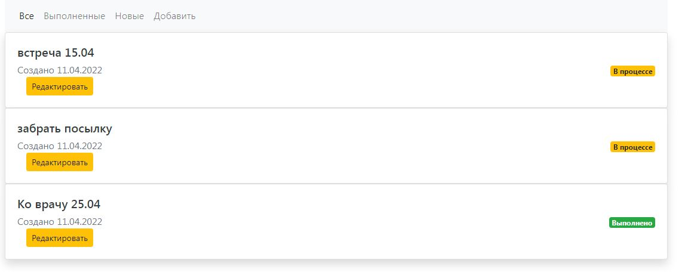
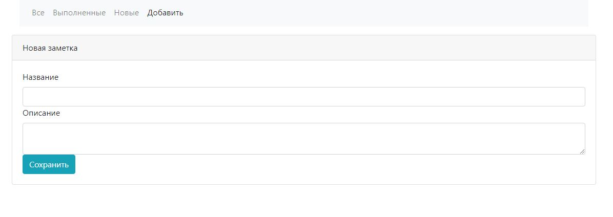
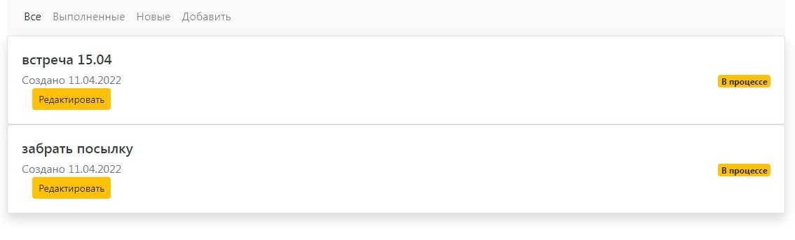
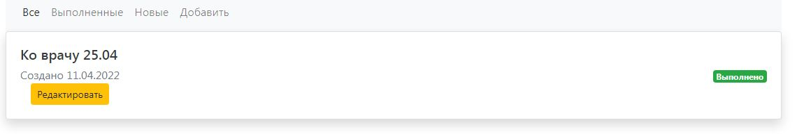
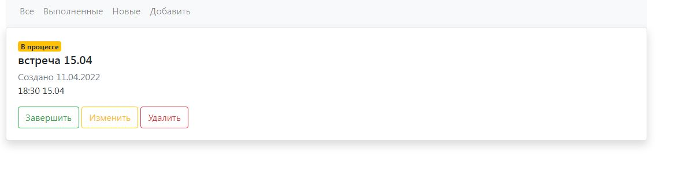

# job4j_todo

В этом приложении можно добавлять новые задачи, отмечать их как выполненные, 
редактировать и удалять.

Вид все задачи

Добавление задачи

Можно отобразить только новые или только выполненные задачи

Можно редактировать задачу и отметить ее как выполненную

